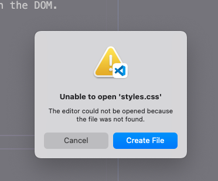

## Initial Prerequisite Steps

1. Check if we have our dependencies (code)

   - Axios
   - Pool
   - Express

   a. `npm install` the libraries or add the script that we need - Added Axios CDN script - `$ npm install pg` - Express dependency is available with `npm install` (it's in our `package.json` under "`dependencies`")

2. Check if we have the right tools (other stuff):
   - Postgres
   - Postico
   - Postman

## Initial Project Setup

1. Get the server running

   - `npm start` should run `node server/server.js`

   a. Optional use - `nodemon` - if so, `npm i nodemon` for a consistently running server. Run `nodemon --exec npm start` to use `nodemon` vs `npm start`.

2. Check for console errors in the DOM

**Errors:**

**CHECK the file:**

**CREATE the file:**

## Intial Database Setup

1. Make sure that `Postgres` is up and running.

2. Open up `Postico` -> localhost -> `+ database` to add a new database.

3. Once database is added, navigate to it and run queries. Store the queries in a `database.sql` file in our project.

4. Connect the project to the database by create a `modules` directory under `server` directory. Add the `pool.js` file. This is where our connection to the database will happen.

5. In the `pools.js`, create a pool object to connect to the database. Ensure the information is correct.

6. Create a router file for the database 

(GET [read] /POST [create] /DELETE [delete] /UPDATE [update])

## Client-side Javascript - GET
1. Create a `get` function. i.e. `getKoalas()` and implement `axios` to obtain data from the server (with routing - `url: '/'`)

Get koalas from the server with `axios`.

  a. Troubleshoot the GET call with `console.log([any message here]);` to check if `axios` route works. The message will display in the DOM (console).

## Router Setup - GET

1. Create GET routing call. 
   GET `koalaRouter.get('/', () => {})`

   a. Troubleshoot the GET call with `console.log([any message here]);` to check if server route works. The message will display in the terminal (server).